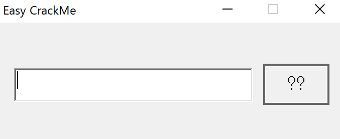

# 解法

問題ファイルとしてEasy_CrackMe.exeが提供される。

pestudioによる表層解析の結果を確認する。32bitの実行形式ファイル。

```
md5,A74DB218A9175E0AE2CCFFB3476DD4CF
sha1,F153F26F16B5AE03E3A7BE7FFE5395E966051F3B
sha256,5EBD45B0D0CEAEE67611357D6849836F6DAAD015467E2948F0AD27CAA516A155
md5-without-overlay,n/a
sha1-without-overlay,n/a
sha256-without-overlay,n/a
first-bytes-hex,4D 5A 90 00 03 00 00 00 04 00 00 00 FF FF 00 00 B8 00 00 00 00 00 00 00 40 00 00 00 00 00 00 00 00 
first-bytes-text,M Z .. .. .. .. .. .. .. .. .. .. .. .. .. .. .. .. .. .. .. .. .. .. @ .. .. .. .. .. .. .. .. 
file-size,40960 (bytes)
size-without-overlay,n/a
entropy,3.494
imphash,C3462ABC2F548A3C192BA361F414F04C
signature,Installer VISE Custom
entry-point,55 8B EC 6A FF 68 B0 50 40 00 68 54 1E 40 00 64 A1 00 00 00 00 50 64 89 25 00 00 00 00 83 EC 58 53 
file-version,n/a
description,n/a
file-type,executable
cpu,32-bit
subsystem,GUI
compiler-stamp,0x4F12C8F5 (Sun Jan 15 21:39:17 2012)
debugger-stamp,n/a
resources-stamp,
exports-stamp,n/a
version-stamp,n/a
certificate-stamp,n/a
```

pestudioによる文字列分析の結果を確認する。
気になるのはこの辺の文字列。メッセージボックスが表示されそう。

```
ascii,10,0x00005401,-,-,-,MessageBox
ascii,14,0x00005533,-,-,-,DialogBoxParam
ascii,9,0x00005544,-,-,-,EndDialog
ascii,10,0x00005551,-,-,-,MessageBox
ascii,14,0x0000555F,-,-,-,GetDlgItemText
ascii,18,0x00006030,-,-,-,Incorrect Password
ascii,17,0x00006044,-,-,-,Congratulation !!
ascii,11,0x00006058,-,-,-,EasyCrackMe
ascii,11,0x0000606A,-,-,-,AGR3versing
unicode,12,0x0000907B,-,-,-,Easy CrackMe
```

Easy_CrackMe.exeを実行すると、以下の画像のようなダイアログが表示される。テキストボックスから文字列を入力することが可能。
ファイルを解析して、正しい入力値を求めるCrackme系の問題だと思う。



IDA Proで静的解析を進めて行く。

関数sub_401080を確認すると、コードの先頭の方でGetDlgItemTextA()や_strncmp()がCallされている。また、コードの末尾の方でMessageBoxA()がCallされている箇所が2箇所あり、片方は第2引数に"Congratulation !!"、もう片方は第2引数に"Incorrect Password"という文字列が渡されている。
MessageBoxA()より前のコードで何らかの判定処理が行われていると思われる。

GetDlgItemTextA()は第3引数からタイトルかテキストボックスの文字列情報を取得する。

```
UINT GetDlgItemTextA(
  [in]  HWND  hDlg,
  [in]  int   nIDDlgItem,
  [out] LPSTR lpString,
  [in]  int   cchMax
);
```

そのため、下記の"[esp+6Ch+String]"にはテキストボックスの入力が入ると思われる。

```
8D 44 24 08                  lea     eax, [esp+6Ch+String]
50                           push    eax ; lpString
68 E8 03 00 00               push    3E8h ; nIDDlgItem
57                           push    edi ; hDlg
FF 15 9C 50 40 00            call    ds:GetDlgItemTextA
```

スタックのStringから見て低いアドレスに向かって、ユーザの入力値が保存されると推測する。

```
-00000064 String          db ?            
-00000063 var_63          db ?            
-00000062 Str1            db ?            
-00000061                 db ? ; undefined
-00000060 var_60          db ?            
-0000005F                 db ? ; undefined
-0000005E                 db ? ; undefined
-0000005D                 db ? ; undefined
-0000005C                 db ? ; undefined
-0000005B                 db ? ; undefined
-0000005A                 db ? ; undefined
-00000059                 db ? ; undefined
-00000058                 db ? ; undefined
```

コードを読み進めていくと、入力値をハードコードされている値と比較する箇所が3箇所存在する。

```
.text:004010B0 80 7C 24 05 61                          cmp     [esp+68h+var_63], 61h ; 'a'
...
...
.text:004010B7 6A 02                                   push    2               ; MaxCount
.text:004010B9 8D 4C 24 0A                             lea     ecx, [esp+6Ch+Str1]
.text:004010BD 68 78 60 40 00                          push    offset Str2     ; "5y"
.text:004010C2 51                                      push    ecx             ; Str1
.text:004010C3 E8 88 00 00 00                          call    _strncmp
...
...
.text:004010D1 BE 6C 60 40 00                          mov     esi, offset aR3versing ; "R3versing"
.text:004010D6 8D 44 24 10                             lea     eax, [esp+70h+var_60]
...
...
.text:0040110D 80 7C 24 04 45                          cmp     [esp+68h+String], 45h ; 'E'
```

これらのハードコードされている文字列を元に、比較処理で入力が期待される値を求めると`Ea5yR3versing`になる。

```
-00000064 String          db ?             // E
-00000063 var_63          db ?             // a
-00000062 Str1            db ?             // 5
-00000061                 db ? ; undefined // y
-00000060 var_60          db ?             // R
-0000005F                 db ? ; undefined // 3
-0000005E                 db ? ; undefined // v
-0000005D                 db ? ; undefined // e
-0000005C                 db ? ; undefined // r
-0000005B                 db ? ; undefined // s
-0000005A                 db ? ; undefined // i
-00000059                 db ? ; undefined // n
-00000058                 db ? ; undefined // g
```

Easy_CrackMe.exeを実行して、テキストボックスにEa5yR3versingと入力すると正解を示すメッセージボックスが表示される。


> Flag : Ea5yR3versing
