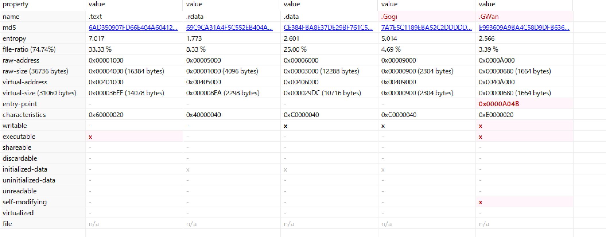

# 解法

問題ファイルとしてEasy_UnpackMe.zipが提供される。解凍するとEasy_UnpackMe.exeとReadMe.txtが得られる。

ReadMe.txtの内容は下記の通り。Easy_UnpackMe.exeのOEP(Original Entry Point)を求める問題っぽい。

```
ReversingKr UnpackMe


Find the OEP

ex) 00401000

```

pestudioで表層解析を実施する。

変な名前のセクションが2つ存在する。

> name,.text,.rdata,.data,.Gogi,.GWan



x64dbgでEasy_UnpackMe.exeを解析する。

エントリーポイントからデバッグを進めていくと、アドレス0040A1FBから離れたアドレス(00401150)にジャンプすることが分かる。

```
0040A04B <easy_unpackme.EntryPoint>       | 68 00A04000             | push easy_unpackme.40A000                      | 40A000:"kernel32.dll"
0040A050                                  | FF15 0DA04000           | call dword ptr ds:[<&LoadLibraryA>]            |
0040A056                                  | A3 44A64000             | mov dword ptr ds:[40A644],eax                  |
0040A05B                                  | 68 18A64000             | push easy_unpackme.40A618                      | 40A618:"GetModuleHandleA"
0040A060                                  | 50                      | push eax                                       |
...
...
0040A1FB                                  | E9 506FFFFF             | ★ jmp easy_unpackme.401150                      |
```

00401150の周辺を確認すると、下記のようなコードになっている。

```
00401150                                  | 75 BB                   | jne easy_unpackme.40110D                       |
00401152                                  | AC                      | lodsb                                          |
00401153                                  | 3AEF                    | cmp ch,bh                                      |
00401155                                  | 48                      | dec eax                                        |
00401156                                  | E0 10                   | loopne easy_unpackme.401168                    |
```

00401150にジャンプするコード(0040A1FB)までデバッグを進めると、00401150の周辺のコードが下記のように変化している。そのため、0040A1FBまでのコードでアンパック処理が行われていて、0040A1FBのジャンプが先である00401150がOEPに該当すると思われる。

```
00401150                                  | 55                      | push ebp                                       |
00401151                                  | 8BEC                    | mov ebp,esp                                    |
00401153                                  | 6A FF                   | push FFFFFFFF                                  |
00401155                                  | 68 D0504000             | push easy_unpackme.4050D0                      |
0040115A                                  | 68 1C1E4000             | push easy_unpackme.401E1C                      |
0040115F                                  | 64:A1 00000000          | mov eax,dword ptr fs:[0]                       |
00401165                                  | 50                      | push eax                                       |
00401166                                  | 64:8925 00000000        | mov dword ptr fs:[0],esp                       |
0040116D                                  | 83EC 58                 | sub esp,58                                     |
```

> FLAG : 00401150
