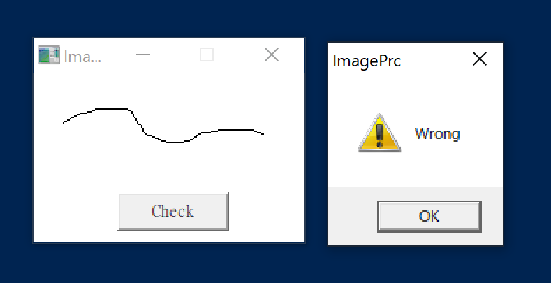
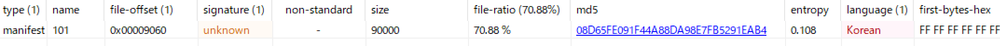

# 解法

問題ファイルとして、ImagePrc.exeという実行形式ファイルが提供される。
実行するとマウス操作で書き込みを行えるダイアログが表示されて、"check"を押下すると不正解を示すメッセージボックスが表示される。



よく分からないのでIDA Proでコードを読んでいく。

関数`sub_401130`を見ていくと、気になる箇所がいくつかある。

FindResourceA()を使用して、Resource領域のデータ(名前は"101")を読み込んでいる。

```
.text:00401381 6A 18                                   push    18h             ; lpType
.text:00401383 6A 65                                   push    101             ; lpName
.text:00401385 6A 00                                   push    0               ; hModule
.text:00401387 FF 15 7C 50 40 00                       call    ds:FindResourceA
```

CreateCompatibleBitmap()をCallしている箇所がある。ここで200*150のビットマップを生成している?

```
.text:004011FE 8B F0                                   mov     esi, eax
.text:00401200 68 96 00 00 00                          push    150             ; cy
.text:00401205 68 C8 00 00 00                          push    200             ; cx
.text:0040120A 56                                      push    esi             ; hdc
.text:0040120B FF 15 0C 50 40 00                       call    ds:CreateCompatibleBitmap
```

以下のコードで不正解時のメッセージボックス呼び出しを行なっているが、正解したときのメッセージを出力する処理は無さそう。

```
.text:004013CD                         loc_4013CD:
.text:004013CD 8B 84 24 90 00 00 00                    mov     eax, [esp+8Ch+hWnd]
.text:004013D4 6A 30                                   push    30h ; '0'       ; uType
.text:004013D6 68 34 60 40 00                          push    offset Caption  ; "ImagePrc"
.text:004013DB 68 40 60 40 00                          push    offset Text     ; "Wrong"
.text:004013E0 50                                      push    eax             ; hWnd
.text:004013E1 FF 15 F8 50 40 00                       call    ds:MessageBoxA
```

正否を判断する比較処理に使われているのがImagePrc.exeのResource領域に含まれるデータ(画像)だと思われるので、これを確認する。



Resource領域のデータ101をダンプしてバイナリエディタで確認すると、ヘッダが含まれていない。このデータはおそらくBitmapファイルなので、ヘッダを自作する。下記のページを参考に、Bitmapファイルのヘッダを作成する。

> Bitmapファイルフォーマット
> http://www.umekkii.jp/data/computer/file_format/bitmap.cgi


Bitmapファイルのヘッダはファイルヘッダ(Bitmap File Header)と情報ヘッダ(Bitmap Information Header)の2つで構成されているらしい。

ファイルヘッダの構成は下記の通り。

```
■ファイルヘッダ (Bitmap File Header)
[0]  bfType       2byte	unsigned int	ファイルタイプ
[2]  bfSize       4byte	unsigned long	ファイルサイズ[byte]
[6]  bfReserved1  2byte	unsigned int	予約領域１	常に0
[8]  bfReserved2  2byte	unsigned int	予約領域２	常に0
[10] bfOffBits    4byte	unsigned long	ファイル先頭から画像データまでのオフセット[byte] = ヘッダサイズ
```

上記の内容を参考に作成した。

```
42 4d
c6 5f 01 00
00 00
00 00
36 00 00 00		// 今回はファイルヘッダ14バイト + 情報ヘッダ40バイト = 54(0x36)バイトだった
```

情報ヘッダの構成は下記の通り。

```
■情報ヘッダ (Bitmap Information Header)
[14]	biSize	    	4byte	unsigned long	情報ヘッダサイズ[byte]	40以下
[18]	biWidth			4byte	long			画像の幅[ピクセル]	
[22]	biHeight		4byte	long			画像の高さ[ピクセル]	
[26]	biPlanes		2byte	unsigned int	プレーン数	常に1
[28]	biBitCount		2byte	unsigned int	色ビット数[bit]	1,4,8,(16),24,32
[30]	biCompression	4byte	unsigned long	圧縮形式	0,1,2,3
[34]	biSizeImage		4byte	unsigned long	画像データサイズ[byte]	
[38]	biXPixPerMeter	4byte	long			水平解像度[dot/m]	0の場合もある
[42]	biYPixPerMeter	4byte	long			垂直解像度[dot/m]	0の場合もある
[46]	biClrUsed		4byte	unsigned long	格納パレット数[使用色数]	0の場合もある
[50]	biCirImportant	4byte	unsigned long	重要色数	0の場合もある
```

上記の内容とファイルヘッダのサイズを参考に作成した。

```
28 00 00 00    // ヘッダ全体54(0x36) - ファイルヘッダ14(0x0E) = 情報ヘッダ40(0x28)
c8 00 00 00
96 00 00 00
01 00
18 00          // どれが適切なのか分からなかったので全部試したら24(0x18)が正解っぽかった
00 00 00 00
90 5f 01 00    // ヘッダサイズを除いたビットマップデータのサイズ = 0x00015f90
00 00 00 00
00 00 00 00
00 00 00 00
00 00 00 00
```

作成したBitmapファイルヘッダをダンプしたファイルの先頭に結合して、拡張子を.bpmに変える。画像ビューアーでファイルを開くとFALG文字列が確認できた。


> FLAG : GOT
