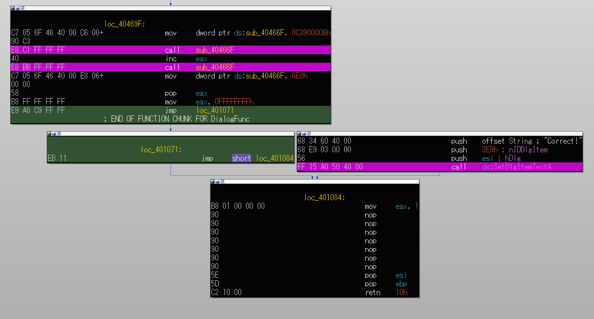
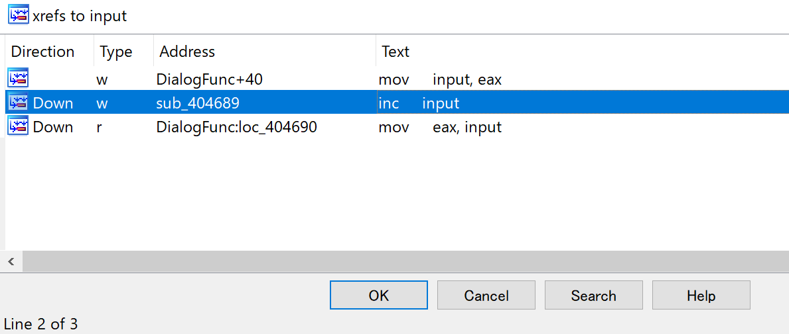

# 解法

問題ファイルとしてReplace.exeが提供される。

Replace.exeを実行すると、メッセージが表示される。テキストボックスから数字が入力可能(アルファベット等は入力できなさそうだった)。


これだけだとよく分からないのでIDA Proで静的解析を実施していく。

DialogFuncのコードを確認すると、SetDlgItemTextA()で"Correct!"というメッセージを表示するコードが存在する。しかし、そのコードはどこからも呼び出されていないように見える。このコードを何らかの方法で呼び出すことがこの問題の目的?



コードを遡って確認すると、GetDlgItemInt()が呼び出されている箇所が見つかる。ここでテキストボックスからの入力を受け取っていると思われる(戻り値eaxのコピー先の004084D0は"input"にリネームした)。


変数inputに格納された値に対する処理を確認していく。
最初に、inputは`sub_404689`でインクリメントされている。sub_404689は2回Callされる。(input = input + 0x02)



```
.text:00404689                         sub_404689      proc near
.text:00404689 FF 05 D0 84 40 00                       inc     input
.text:0040468F C3                                      retn
.text:0040468F                         sub_404689      endp
```

sub_404689の実行後、return命令の戻り先が`loc_404674`になっていてinputに0x601605c7が加算される。(input = input = 0x601605c7)

```
.text:00404674                         loc_404674:
.text:00404674 81 05 D0 84 40 00 C7 05+                add     input, 601605C7h
.text:00404674 16 60
.text:0040467E 40                                      inc     eax
.text:0040467F 00 EB                                   add     bl, ch
.text:0040467F                         sub_40466F      endp
```

再度、sub_404689が2回Callされる。(input = input + 0x02)

```
.text:00404689                         sub_404689      proc near
.text:00404689 FF 05 D0 84 40 00                       inc     input
.text:0040468F C3                                      retn
.text:0040468F                         sub_404689      endp
```

アドレス0x00404690でeaxにinputをコピーする。この時点でinputの値は`input + 0x02 + 0x601605c7 + 0x02`という状態になっている。

```
.text:00404690                         loc_404690:
.text:00404690 A1 D0 84 40 00                          mov     eax, input
```

下記のコードでは0x0040466Fの値を0x0C39000C6で上書きしている。

```
.text:0040469F                         loc_40469F:
.text:0040469F C7 05 6F 46 40 00 C6 00+mov     dword ptr ds:sub_40466F, 0C39000C6h
.text:0040469F 90 C3
```

上書きされていたsub_40466Fを確認する。コードを一度Undefineして、0xC39000C6の部分を再度Analysisすると、eaxレジスタが指しているアドレスの現在の値を0x90(NOP)で上書きしていることが分かる。

```
.text:0040466F                         loc_40466F:
.text:0040466F
.text:0040466F C6 00 90                mov     byte ptr [eax], 90h  ★NOP命令で上書き
.text:00404672 C3                      retn
```

sub_40466Fは2回Callされていて、eaxのインクリメントが挟まる。そのため、あるアドレスから2バイト分の値をNOP命令で上書きすることが可能になっている。

```
.text:004046A9 E8 C1 FF FF FF          call    sub_40466F
.text:004046AE 40                      inc     eax
.text:004046AF E8 BB FF FF FF          call    sub_40466F
```

この時点で何をNOP命令で潰したいか考えると、アドレス0x00401071に存在するjmp命令だと思う。そのため、`変数inputの最終的な値が0x00401071になるような入力値`を求める必要がある。

```
.text:00401071
.text:00401071                         loc_401071:
.text:00401071 EB 11                   jmp     short loc_401084 ★この2バイト命令が邪魔
.text:00401073                         ; ---------------------------------------------------------------------------
.text:00401073 68 34 60 40 00          push    offset String                   ; "Correct!"
.text:00401078 68 E9 03 00 00          push    3E9h                            ; nIDDlgItem
.text:0040107D 56                      push    esi                             ; hDlg
.text:0040107E FF 15 A0 50 40 00       call    ds:SetDlgItemTextA
```

`0x00401071 = input + 0x2 + 0x601605C7 + 0x2`を満たす入力値を求めたいが、これは無理そう。ただし、EAXレジスタは8バイト(32ビット)までしかデータが格納出来ず、桁があふれると破棄されるため、8バイト目までが0x00401071になっていれば良いと思われる。

そのため、代わりに`0x100401071 = input + 0x2 + 0x601605C7 + 0x2`を満たす入力値を求める。この計算式を満たすinputの値は0xA02A0AA6(10進数で`2687109798`)になる。
inputの値は0x200401071とかでも行けるのか?と思ったが、それだとinputに入るべき値が6982077094になって32ビット以上になるから駄目そう。

IDA Proでデバッグを進めて、メッセージのテキストボックスから2687109798を入力してデバッグを進めると、最終的にjmp命令がNOPされてSetDlgItemTextA()がCallされることが確認できた。


```
.text:00401071                         loc_401071:
.text:00401071 90                      nop
.text:00401072 90                      nop
.text:00401073 68 34 60 40 00          push    offset String                   ; "Correct!"
.text:00401078 68 E9 03 00 00          push    3E9h                            ; nIDDlgItem
.text:0040107D 56                      push    esi                             ; hDlg
.text:0040107E FF 15 A0 50 40 00       call    ds:SetDlgItemTextA
```

> FLAG : 2687109798
